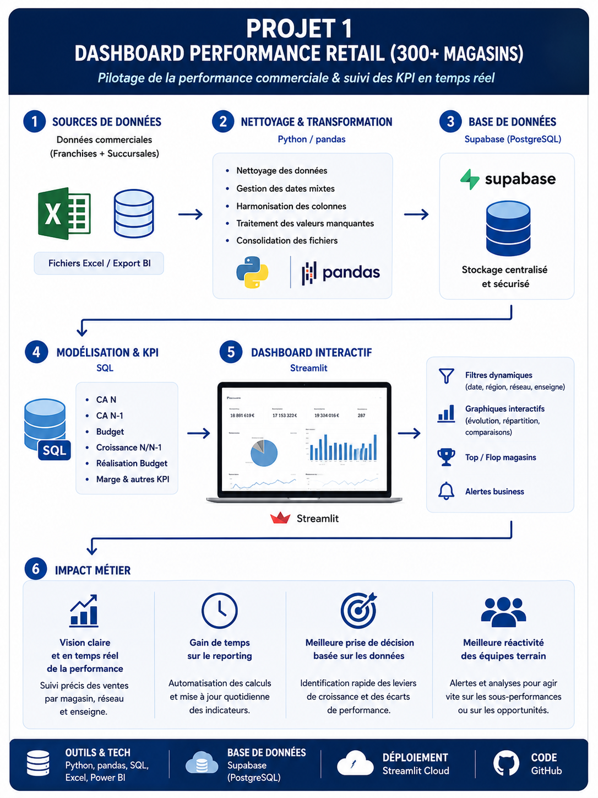
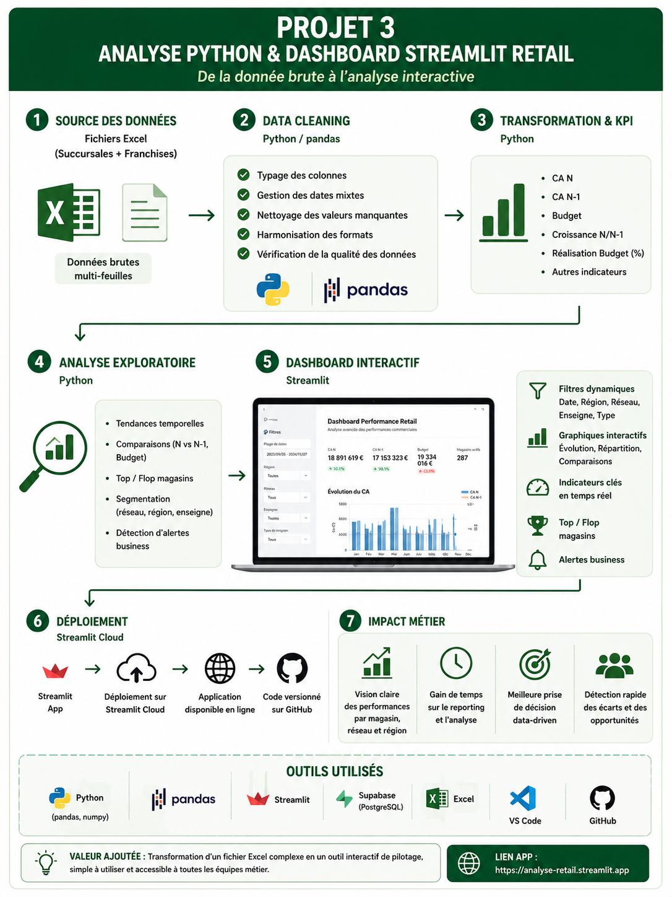

<!DOCTYPE html>
<html lang="fr">

<head>
  <meta charset="UTF-8" />
  <meta name="viewport" content="width=device-width, initial-scale=1" />
  <title>Christophe DOSSA - Data Analyst</title>

  
</head>

<body>

  <nav>
    <a href="#about">À propos</a>
    <a href="#skills">Compétences</a>
    <a href="#projects">Projets</a>
    <a href="#contact">Contact</a>
  </nav>

  <header>

    

      Disponible immédiatement • Mobilité France entière
    

    <h1>Christophe DOSSA</h1>

    

      Data Analyst orienté <b>BI & Reporting</b> — spécialisé dans
      l’analyse de performance, l’automatisation des flux de données
      et le développement de dashboards interactifs.
    

    

      <a class="btn btn-primary"
         href="./DOSSA_Christophe_Data_Analyst.pdf"
         target="_blank">
        📄 Télécharger mon CV
      </a>

      <a class="btn btn-ghost"
         href="https://www.linkedin.com/in/aime-christophe-dossa/"
         target="_blank">
        🔗 LinkedIn
      </a>

      <a class="btn btn-ghost"
         href="https://github.com/pharno1"
         target="_blank">
        💻 GitHub
      </a>

      <a class="btn btn-ghost"
         href="./projects.html">
        📌 Projets détaillés
      </a>

    

  </header>

  <main>

    <!-- ABOUT -->
    <section id="about">

      <h2>À propos</h2>

      

        

          Data Analyst spécialisé en Business Intelligence et pilotage
          de la performance, avec une expérience en environnement retail national
          (300+ magasins).
        

        

          J’interviens sur la conception de dashboards, l’analyse de KPI business,
          l’automatisation des flux de données et la structuration d’architectures data.
        

      

    </section>

    <!-- SKILLS -->
    <section id="skills">

      <h2>Compétences</h2>

      

        

          <h3>Analyse & BI</h3>

          Power BI
          Looker Studio
          Tableau
          Excel VBA
          KPI
        

        

          <h3>Data & Tech</h3>

          Python
          pandas
          SQL
          API
          ETL/ELT
          Supabase
        

      

    </section>

    <!-- PROJECTS -->
    <section id="projects">

      <h2>Projets</h2>

      

        <!-- PROJET 1 -->
        

          <h3 class="project-title">
            Projet 1 — Dashboard Performance Retail
          </h3>

          

            Power BI • KPI • Streamlit • Retail Analytics
          

          

            Développement d’un dashboard interactif permettant de suivre
            la performance commerciale d’un réseau de plus de 300 magasins.
          

          

          

            <a class="link-btn"
               href="https://dashboard-performance-retail.streamlit.app/"
               target="_blank">
              🚀 Dashboard live
            </a>

            <a class="link-btn"
               href="https://github.com/pharno1/dashboard-performance-retail"
               target="_blank">
              💻 Code GitHub
            </a>

          

        

        <!-- PROJET 3 -->
        

          <h3 class="project-title">
            Projet 3 — Analyse Python & Dashboard Streamlit
          </h3>

          

            Python • pandas • Streamlit • Data Cleaning
          

          

            Nettoyage, transformation et visualisation de données retail
            avec développement d’une application Streamlit interactive.
          

          

          

            <a class="link-btn"
               href="https://analyse-retail.streamlit.app/"
               target="_blank">
              🚀 Application live
            </a>

            <a class="link-btn"
               href="https://github.com/pharno1/analyse-retail"
               target="_blank">
              💻 Code GitHub
            </a>

          

        

      

      <!-- PROJET 2 -->
      

        <h3 class="project-title">
          Projet 2 — Automatisation API → Cube BI
        </h3>

        

          API • ETL/ELT • AWS • Sage BI
        

        

          Automatisation et fiabilisation des flux achats pour alimenter
          un cube BI destiné au pilotage métier et à l’analyse fournisseurs.
        

      

    </section>

    <!-- CONTACT -->
    <section id="contact">

      <h2>Contact</h2>

      

        

          <b>Email :</b> aimechristophedossa@gmail.com
        

        

          <a href="https://www.linkedin.com/in/aime-christophe-dossa/"
             target="_blank">
            🔗 LinkedIn
          </a>

          <a href="https://github.com/pharno1"
             target="_blank">
            💻 GitHub
          </a>

          <a href="./DOSSA_Christophe_Data_Analyst.pdf"
             target="_blank">
            📄 CV PDF
          </a>

        

        

          Disponible pour un poste Data Analyst / BI orienté
          reporting, performance et automatisation.
        

      

    </section>

  </main>

  <footer>
    © 2026 Christophe DOSSA • Portfolio Data Analyst
  </footer>

</body>
</html>
